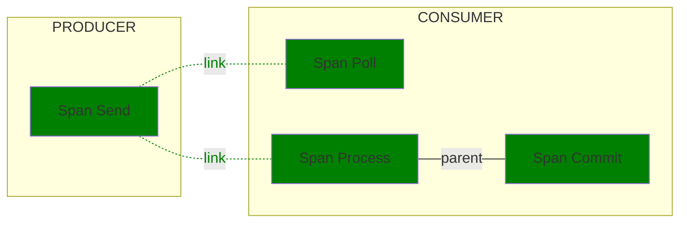

<!--- Hugo front matter used to generate the website version of this page:
linkTitle: Kafka
--->

# Semantic conventions for Kafka

**Status**: [Development][DocumentStatus]

<!-- START doctoc -->

- [Kafka spans](#kafka-spans)
  - [Create span](#create-span)
  - [Send span (producer)](#send-span-producer)
  - [Send span (client)](#send-span-client)
  - [Receive span](#receive-span)
  - [Process span](#process-span)
  - [Settle span](#settle-span)
- [Examples](#examples)
  - [Apache Kafka with Quarkus or Spring Boot example](#apache-kafka-with-quarkus-or-spring-boot-example)

<!-- END doctoc -->

The Semantic Conventions for [Apache Kafka](https://kafka.apache.org/) extend and override the [Messaging Semantic Conventions](README.md).

> [!IMPORTANT]
>
> Existing messaging instrumentations that are using
> [v1.24.0 of this document](https://github.com/open-telemetry/semantic-conventions/blob/v1.24.0/docs/messaging/messaging-spans.md)
> (or prior):
>
> * SHOULD NOT change the version of the messaging conventions that they emit by default
>   until the messaging semantic conventions are marked stable.
>   Conventions include, but are not limited to, attributes,
>   metric and span names, span kind and unit of measure.
> * SHOULD introduce an environment variable `OTEL_SEMCONV_STABILITY_OPT_IN`
>   in the existing major version as a comma-separated list of category-specific values
>   (e.g., http, databases, messaging). The list of values includes:
>   * `messaging` - emit the new, stable messaging conventions,
>     and stop emitting the old experimental messaging conventions
>     that the instrumentation emitted previously.
>   * `messaging/dup` - emit both the old and the stable messaging conventions,
>     allowing for a seamless transition.
>   * The default behavior (in the absence of one of these values) is to continue
>     emitting whatever version of the old experimental messaging conventions
>     the instrumentation was emitting previously.
>   * Note: `messaging/dup` has higher precedence than `messaging` in case both values are present
> * SHOULD maintain (security patching at a minimum) the existing major version
>   for at least six months after it starts emitting both sets of conventions.
> * SHOULD drop the environment variable in the next major version.
> * SHOULD emit the new, stable values for span name, span kind and similar "single"
> valued concepts when `messaging/dup` is present in the list.

## Kafka spans

### Create span

<!-- semconv span.messaging.kafka.create.producer -->
<!-- NOTE: THIS TEXT IS AUTOGENERATED. DO NOT EDIT BY HAND. -->
<!-- see templates/registry/markdown/snippet.md.j2 -->
<!-- prettier-ignore-start -->

**Status:** 

Describes a message being created for sending to Apache Kafka.

"Create" spans always refer to a single message and are used to provide a unique
creation context for messages in batch sending scenarios. A "Create" span is only
used together with a client "Send" span (`messaging.send.client`) that links to it;
when the "Send" span itself serves as the creation context, use the producer "Send"
span (`messaging.send.producer`) instead and omit the "Create" span. See
[Producer spans](/docs/messaging/messaging-spans.md#producer-spans) for details.

**Span kind** SHOULD be `PRODUCER`.

**Span status** SHOULD follow the [Recording Errors](/docs/general/recording-errors.md) document.

**Attributes:**

| Key | Stability | [Requirement Level](https://opentelemetry.io/docs/specs/semconv/general/attribute-requirement-level/) | Value Type | Description | Example Values |
| --- | --- | --- | --- | --- | --- |
| [`messaging.operation.name`](/docs/registry/attributes/messaging.md) |  | `Required` | string | The system-specific name of the messaging operation. | `create` |
| [`messaging.system`](/docs/registry/attributes/messaging.md) |  | `Required` | string | The messaging system as identified by the client instrumentation. [1] | `kafka` |
| [`error.type`](/docs/registry/attributes/error.md) |  | `Conditionally Required` If and only if the messaging operation has failed. | string | Describes a class of error the operation ended with. [2] | `UNKNOWN_TOPIC_OR_PARTITION`; `KAFKA_STORAGE_ERROR`; `NOT_ENOUGH_REPLICAS` |
| [`messaging.destination.name`](/docs/registry/attributes/messaging.md) |  | `Conditionally Required` [3] | string | The message destination name [4] | `MyTopic` |
| [`messaging.destination.template`](/docs/registry/attributes/messaging.md) |  | `Conditionally Required` [5] | string | Low cardinality representation of the messaging destination name [6] | `/customers/{customerId}` |
| [`messaging.kafka.message.tombstone`](/docs/registry/attributes/messaging.md) |  | `Conditionally Required` [7] | boolean | A boolean that is true if the message is a tombstone. | |
| [`messaging.operation.type`](/docs/registry/attributes/messaging.md) |  | `Conditionally Required` If applicable. | string | A string identifying the type of the messaging operation. [8] | `create` |
| [`messaging.destination.partition.id`](/docs/registry/attributes/messaging.md) |  | `Recommended` When applicable. | string | The identifier of the partition messages are sent to or received from, unique within the `messaging.destination.name`. | `1` |
| [`messaging.kafka.message.key`](/docs/registry/attributes/messaging.md) |  | `Recommended` If span describes operation on a single message. | string | Message keys in Kafka are used for grouping alike messages to ensure they're processed on the same partition. They differ from `messaging.message.id` in that they're not unique. If the key is `null`, the attribute MUST NOT be set. [9] | `myKey` |
| [`messaging.message.conversation_id`](/docs/registry/attributes/messaging.md) |  | `Recommended` | string | The conversation ID identifying the conversation to which the message belongs, represented as a string. Sometimes called "Correlation ID". | `MyConversationId` |
| [`messaging.message.id`](/docs/registry/attributes/messaging.md) |  | `Recommended` If span describes operation on a single message. | string | A value used by the messaging system as an identifier for the message, represented as a string. | `452a7c7c7c7048c2f887f61572b18fc2` |
| [`server.address`](/docs/registry/attributes/server.md) |  | `Recommended` | string | Server domain name if available without reverse DNS lookup; otherwise, IP address or UNIX domain socket name. [10] | `example.com`; `10.1.2.80`; `/tmp/my.sock` |
| [`server.port`](/docs/registry/attributes/server.md) |  | `Recommended` | int | Server port number. [11] | `80`; `8080`; `443` |
| [`messaging.message.body.size`](/docs/registry/attributes/messaging.md) |  | `Opt-In` | int | The size of the message body in bytes. Only applicable for spans describing single message operations. [12] | `1439` |
| [`messaging.message.envelope.size`](/docs/registry/attributes/messaging.md) |  | `Opt-In` | int | The size of the message body and metadata in bytes. [13] | `2738` |

**[1] `messaging.system`:** MUST be set to `"kafka"`.

**[2] `error.type`:** The `error.type` SHOULD be predictable, and SHOULD have low cardinality.

When `error.type` is set to a type (e.g., an exception type), its
canonical class name identifying the type within the artifact SHOULD be used.

If the recorded error type is a wrapper that is not meaningful for
failure classification, instrumentation MAY use the type of the inner
error instead. For example, in Go, errors created with `fmt.Errorf`
using `%w` MAY be unwrapped when the wrapper type does not help
classify the failure.

Instrumentations SHOULD document the list of errors they report.

The cardinality of `error.type` within one instrumentation library SHOULD be low.
Telemetry consumers that aggregate data from multiple instrumentation libraries and applications
should be prepared for `error.type` to have high cardinality at query time when no
additional filters are applied.

If the operation has completed successfully, instrumentations SHOULD NOT set `error.type`.

If a specific domain defines its own set of error identifiers (such as HTTP or RPC status codes),
it's RECOMMENDED to:

- Use a domain-specific attribute
- Set `error.type` to capture all errors, regardless of whether they are defined within the domain-specific set or not.

**[3] `messaging.destination.name`:** If span describes operation on a single message or if the value applies to all messages in the batch.

**[4] `messaging.destination.name`:** SHOULD uniquely identify a specific queue, topic or other entity within the broker. If
the broker doesn't have such notion, it SHOULD uniquely identify the broker.

**[5] `messaging.destination.template`:** If available. Instrumentations MUST NOT use `messaging.destination.name` as template unless low-cardinality of destination name is guaranteed.

**[6] `messaging.destination.template`:** Destination names could be constructed from templates. An example would be a destination name involving a username or product ID. Although the destination name in this case is of high cardinality, the underlying template is of low cardinality and can be effectively used for grouping and aggregation.

**[7] `messaging.kafka.message.tombstone`:** If value is `true`. When missing, the value is assumed to be `false`.

**[8] `messaging.operation.type`:** SHOULD be set to `create`.

**[9] `messaging.kafka.message.key`:** If the key type is not string, it's string representation has to be supplied for the attribute. If the key has no unambiguous, canonical string form, don't include its value.

**[10] `server.address`:** Server domain name of the broker if available without reverse DNS lookup; otherwise, IP address or UNIX domain socket name.

**[11] `server.port`:** When observed from the client side, and when communicating through an intermediary, `server.port` SHOULD represent the server port behind any intermediaries, for example proxies, if it's available.

**[12] `messaging.message.body.size`:** This can refer to both the compressed or uncompressed body size. If both sizes are known, the uncompressed
body size should be used.

**[13] `messaging.message.envelope.size`:** This can refer to both the compressed or uncompressed size. If both sizes are known, the uncompressed
size should be used.

The following attributes can be important for making sampling decisions
and SHOULD be provided **at span creation time** (if provided at all):

* [`messaging.destination.name`](/docs/registry/attributes/messaging.md)
* [`messaging.destination.partition.id`](/docs/registry/attributes/messaging.md)
* [`messaging.destination.template`](/docs/registry/attributes/messaging.md)
* [`messaging.operation.name`](/docs/registry/attributes/messaging.md)
* [`messaging.operation.type`](/docs/registry/attributes/messaging.md)
* [`messaging.system`](/docs/registry/attributes/messaging.md)
* [`server.address`](/docs/registry/attributes/server.md)
* [`server.port`](/docs/registry/attributes/server.md)

---

`error.type` has the following list of well-known values. If one of them applies, then the respective value MUST be used; otherwise, a custom value MAY be used.

| Value | Description | Stability |
| --- | --- | --- |
| `_OTHER` | A fallback error value to be used when the instrumentation doesn't define a custom value. |  |

---

`messaging.operation.type` has the following list of well-known values. If one of them applies, then the respective value MUST be used; otherwise, a custom value MAY be used.

| Value | Description | Stability |
| --- | --- | --- |
| `create` | A message is created. "Create" spans always refer to a single message and are used to provide a unique creation context for messages in batch sending scenarios. |  |
| `process` | One or more messages are processed by a consumer. |  |
| `receive` | One or more messages are requested by a consumer. This operation refers to pull-based scenarios, where consumers explicitly call methods of messaging SDKs to receive messages. |  |
| `send` | One or more messages are provided for sending to an intermediary. If a single message is sent, the context of the "Send" span can be used as the creation context and no "Create" span needs to be created. |  |
| `settle` | One or more messages are settled. |  |

---

`messaging.system` has the following list of well-known values. If one of them applies, then the respective value MUST be used; otherwise, a custom value MAY be used.

| Value | Description | Stability |
| --- | --- | --- |
| `activemq` | Apache ActiveMQ |  |
| `aws.sns` | Amazon Simple Notification Service (SNS) |  |
| `aws_sqs` | Amazon Simple Queue Service (SQS) |  |
| `eventgrid` | Azure Event Grid |  |
| `eventhubs` | Azure Event Hubs |  |
| `gcp_pubsub` | Google Cloud Pub/Sub |  |
| `jms` | Java Message Service |  |
| `kafka` | Apache Kafka |  |
| `pulsar` | Apache Pulsar |  |
| `rabbitmq` | RabbitMQ |  |
| `rocketmq` | Apache RocketMQ |  |
| `servicebus` | Azure Service Bus |  |

<!-- prettier-ignore-end -->
<!-- END AUTOGENERATED TEXT -->
<!-- endsemconv -->

### Send span (producer)

<!-- semconv span.messaging.kafka.send.producer -->
<!-- NOTE: THIS TEXT IS AUTOGENERATED. DO NOT EDIT BY HAND. -->
<!-- see templates/registry/markdown/snippet.md.j2 -->
<!-- prettier-ignore-start -->

**Status:** 

Describes a producer sending one or more messages to Apache Kafka.

Use this span when no separate "Create" span exists and the "Send" span's context is
injected into the message(s) as the creation context. See
[Producer spans](/docs/messaging/messaging-spans.md#producer-spans) for details.

**Span kind** SHOULD be `PRODUCER`.

**Span status** SHOULD follow the [Recording Errors](/docs/general/recording-errors.md) document.

**Attributes:**

| Key | Stability | [Requirement Level](https://opentelemetry.io/docs/specs/semconv/general/attribute-requirement-level/) | Value Type | Description | Example Values |
| --- | --- | --- | --- | --- | --- |
| [`messaging.operation.name`](/docs/registry/attributes/messaging.md) |  | `Required` | string | The system-specific name of the messaging operation. | `send`; `publish` |
| [`messaging.system`](/docs/registry/attributes/messaging.md) |  | `Required` | string | The messaging system as identified by the client instrumentation. [1] | `kafka` |
| [`error.type`](/docs/registry/attributes/error.md) |  | `Conditionally Required` If and only if the messaging operation has failed. | string | Describes a class of error the operation ended with. [2] | `UNKNOWN_TOPIC_OR_PARTITION`; `KAFKA_STORAGE_ERROR`; `NOT_ENOUGH_REPLICAS` |
| [`messaging.batch.message_count`](/docs/registry/attributes/messaging.md) |  | `Conditionally Required` [3] | int | The number of messages sent, received, or processed in the scope of the batching operation. [4] | `0`; `1`; `2` |
| [`messaging.destination.name`](/docs/registry/attributes/messaging.md) |  | `Conditionally Required` [5] | string | The message destination name [6] | `MyTopic` |
| [`messaging.destination.template`](/docs/registry/attributes/messaging.md) |  | `Conditionally Required` [7] | string | Low cardinality representation of the messaging destination name [8] | `/customers/{customerId}` |
| [`messaging.kafka.message.tombstone`](/docs/registry/attributes/messaging.md) |  | `Conditionally Required` [9] | boolean | A boolean that is true if the message is a tombstone. | |
| [`messaging.operation.type`](/docs/registry/attributes/messaging.md) |  | `Conditionally Required` If applicable. | string | A string identifying the type of the messaging operation. [10] | `send` |
| [`messaging.client.id`](/docs/registry/attributes/messaging.md) |  | `Recommended` | string | A unique identifier for the client that consumes or produces a message. | `client-5`; `myhost@8742@s8083jm` |
| [`messaging.destination.partition.id`](/docs/registry/attributes/messaging.md) |  | `Recommended` When applicable. | string | The identifier of the partition messages are sent to or received from, unique within the `messaging.destination.name`. | `1` |
| [`messaging.kafka.cluster.id`](/docs/registry/attributes/messaging.md) |  | `Recommended` | string | The Kafka cluster ID, obtained from the broker metadata exposed through the Kafka client (or AdminClient) API. [11] | `MkU3OEVBNTcwNTJENDM2Qk` |
| [`messaging.kafka.message.key`](/docs/registry/attributes/messaging.md) |  | `Recommended` If span describes operation on a single message. | string | Message keys in Kafka are used for grouping alike messages to ensure they're processed on the same partition. They differ from `messaging.message.id` in that they're not unique. If the key is `null`, the attribute MUST NOT be set. [12] | `myKey` |
| [`messaging.kafka.offset`](/docs/registry/attributes/messaging.md) |  | `Recommended` If span describes operation on a single message. | int | The offset of a record in the corresponding Kafka partition. | `42` |
| [`messaging.message.conversation_id`](/docs/registry/attributes/messaging.md) |  | `Recommended` | string | The conversation ID identifying the conversation to which the message belongs, represented as a string. Sometimes called "Correlation ID". | `MyConversationId` |
| [`messaging.message.id`](/docs/registry/attributes/messaging.md) |  | `Recommended` If span describes operation on a single message. | string | A value used by the messaging system as an identifier for the message, represented as a string. | `452a7c7c7c7048c2f887f61572b18fc2` |
| [`network.peer.address`](/docs/registry/attributes/network.md) |  | `Recommended` If applicable for this messaging system. | string | Peer address of the messaging intermediary node where the operation was performed. [13] | `10.1.2.80`; `/tmp/my.sock` |
| [`network.peer.port`](/docs/registry/attributes/network.md) |  | `Recommended` if and only if `network.peer.address` is set. | int | Peer port of the messaging intermediary node where the operation was performed. | `65123` |
| [`server.address`](/docs/registry/attributes/server.md) |  | `Recommended` | string | Server domain name if available without reverse DNS lookup; otherwise, IP address or UNIX domain socket name. [14] | `example.com`; `10.1.2.80`; `/tmp/my.sock` |
| [`server.port`](/docs/registry/attributes/server.md) |  | `Recommended` | int | Server port number. [15] | `80`; `8080`; `443` |
| [`messaging.message.body.size`](/docs/registry/attributes/messaging.md) |  | `Opt-In` | int | The size of the message body in bytes. Only applicable for spans describing single message operations. [16] | `1439` |
| [`messaging.message.envelope.size`](/docs/registry/attributes/messaging.md) |  | `Opt-In` | int | The size of the message body and metadata in bytes. [17] | `2738` |

**[1] `messaging.system`:** MUST be set to `"kafka"`.

**[2] `error.type`:** The `error.type` SHOULD be predictable, and SHOULD have low cardinality.

When `error.type` is set to a type (e.g., an exception type), its
canonical class name identifying the type within the artifact SHOULD be used.

If the recorded error type is a wrapper that is not meaningful for
failure classification, instrumentation MAY use the type of the inner
error instead. For example, in Go, errors created with `fmt.Errorf`
using `%w` MAY be unwrapped when the wrapper type does not help
classify the failure.

Instrumentations SHOULD document the list of errors they report.

The cardinality of `error.type` within one instrumentation library SHOULD be low.
Telemetry consumers that aggregate data from multiple instrumentation libraries and applications
should be prepared for `error.type` to have high cardinality at query time when no
additional filters are applied.

If the operation has completed successfully, instrumentations SHOULD NOT set `error.type`.

If a specific domain defines its own set of error identifiers (such as HTTP or RPC status codes),
it's RECOMMENDED to:

- Use a domain-specific attribute
- Set `error.type` to capture all errors, regardless of whether they are defined within the domain-specific set or not.

**[3] `messaging.batch.message_count`:** If the span describes an operation on a batch of messages.

**[4] `messaging.batch.message_count`:** Instrumentations SHOULD NOT set `messaging.batch.message_count` on spans that operate with a single message. When a messaging client library supports both batch and single-message API for the same operation, instrumentations SHOULD use `messaging.batch.message_count` for batching APIs and SHOULD NOT use it for single-message APIs.

**[5] `messaging.destination.name`:** If span describes operation on a single message or if the value applies to all messages in the batch.

**[6] `messaging.destination.name`:** SHOULD uniquely identify a specific queue, topic or other entity within the broker. If
the broker doesn't have such notion, it SHOULD uniquely identify the broker.

**[7] `messaging.destination.template`:** If available. Instrumentations MUST NOT use `messaging.destination.name` as template unless low-cardinality of destination name is guaranteed.

**[8] `messaging.destination.template`:** Destination names could be constructed from templates. An example would be a destination name involving a username or product ID. Although the destination name in this case is of high cardinality, the underlying template is of low cardinality and can be effectively used for grouping and aggregation.

**[9] `messaging.kafka.message.tombstone`:** If value is `true`. When missing, the value is assumed to be `false`.

**[10] `messaging.operation.type`:** SHOULD be set to `send`.

**[11] `messaging.kafka.cluster.id`:** The cluster ID is a unique identifier reported by the Kafka broker. It identifies the cluster independently of the individual brokers the client is configured to connect to, and remains stable even if broker hostnames, IP addresses, or ports change.

**[12] `messaging.kafka.message.key`:** If the key type is not string, it's string representation has to be supplied for the attribute. If the key has no unambiguous, canonical string form, don't include its value.

**[13] `network.peer.address`:** Semantic conventions for individual messaging systems SHOULD document whether `network.peer.*` attributes are applicable.
Network peer address and port are important when the application interacts with individual intermediary nodes directly,
If a messaging operation involved multiple network calls (for example retries), the address of the last contacted node SHOULD be used.

**[14] `server.address`:** Server domain name of the broker if available without reverse DNS lookup; otherwise, IP address or UNIX domain socket name.

**[15] `server.port`:** When observed from the client side, and when communicating through an intermediary, `server.port` SHOULD represent the server port behind any intermediaries, for example proxies, if it's available.

**[16] `messaging.message.body.size`:** This can refer to both the compressed or uncompressed body size. If both sizes are known, the uncompressed
body size should be used.

**[17] `messaging.message.envelope.size`:** This can refer to both the compressed or uncompressed size. If both sizes are known, the uncompressed
size should be used.

The following attributes can be important for making sampling decisions
and SHOULD be provided **at span creation time** (if provided at all):

* [`messaging.destination.name`](/docs/registry/attributes/messaging.md)
* [`messaging.destination.partition.id`](/docs/registry/attributes/messaging.md)
* [`messaging.destination.template`](/docs/registry/attributes/messaging.md)
* [`messaging.operation.name`](/docs/registry/attributes/messaging.md)
* [`messaging.operation.type`](/docs/registry/attributes/messaging.md)
* [`messaging.system`](/docs/registry/attributes/messaging.md)
* [`server.address`](/docs/registry/attributes/server.md)
* [`server.port`](/docs/registry/attributes/server.md)

---

`error.type` has the following list of well-known values. If one of them applies, then the respective value MUST be used; otherwise, a custom value MAY be used.

| Value | Description | Stability |
| --- | --- | --- |
| `_OTHER` | A fallback error value to be used when the instrumentation doesn't define a custom value. |  |

---

`messaging.operation.type` has the following list of well-known values. If one of them applies, then the respective value MUST be used; otherwise, a custom value MAY be used.

| Value | Description | Stability |
| --- | --- | --- |
| `create` | A message is created. "Create" spans always refer to a single message and are used to provide a unique creation context for messages in batch sending scenarios. |  |
| `process` | One or more messages are processed by a consumer. |  |
| `receive` | One or more messages are requested by a consumer. This operation refers to pull-based scenarios, where consumers explicitly call methods of messaging SDKs to receive messages. |  |
| `send` | One or more messages are provided for sending to an intermediary. If a single message is sent, the context of the "Send" span can be used as the creation context and no "Create" span needs to be created. |  |
| `settle` | One or more messages are settled. |  |

---

`messaging.system` has the following list of well-known values. If one of them applies, then the respective value MUST be used; otherwise, a custom value MAY be used.

| Value | Description | Stability |
| --- | --- | --- |
| `activemq` | Apache ActiveMQ |  |
| `aws.sns` | Amazon Simple Notification Service (SNS) |  |
| `aws_sqs` | Amazon Simple Queue Service (SQS) |  |
| `eventgrid` | Azure Event Grid |  |
| `eventhubs` | Azure Event Hubs |  |
| `gcp_pubsub` | Google Cloud Pub/Sub |  |
| `jms` | Java Message Service |  |
| `kafka` | Apache Kafka |  |
| `pulsar` | Apache Pulsar |  |
| `rabbitmq` | RabbitMQ |  |
| `rocketmq` | Apache RocketMQ |  |
| `servicebus` | Azure Service Bus |  |

<!-- prettier-ignore-end -->
<!-- END AUTOGENERATED TEXT -->
<!-- endsemconv -->

### Send span (client)

<!-- semconv span.messaging.kafka.send.client -->
<!-- NOTE: THIS TEXT IS AUTOGENERATED. DO NOT EDIT BY HAND. -->
<!-- see templates/registry/markdown/snippet.md.j2 -->
<!-- prettier-ignore-start -->

**Status:** 

Describes a producer sending one or more messages to Apache Kafka.

Use this span when a "Create" span (or a custom creation context) already exists for the
message(s): the "Send" span describes only the transport operation and links to the
creation context that was injected into the message. See
[Producer spans](/docs/messaging/messaging-spans.md#producer-spans) for details.

**Span kind** SHOULD be `CLIENT`.

**Span status** SHOULD follow the [Recording Errors](/docs/general/recording-errors.md) document.

**Attributes:**

| Key | Stability | [Requirement Level](https://opentelemetry.io/docs/specs/semconv/general/attribute-requirement-level/) | Value Type | Description | Example Values |
| --- | --- | --- | --- | --- | --- |
| [`messaging.operation.name`](/docs/registry/attributes/messaging.md) |  | `Required` | string | The system-specific name of the messaging operation. | `send`; `publish` |
| [`messaging.system`](/docs/registry/attributes/messaging.md) |  | `Required` | string | The messaging system as identified by the client instrumentation. [1] | `kafka` |
| [`error.type`](/docs/registry/attributes/error.md) |  | `Conditionally Required` If and only if the messaging operation has failed. | string | Describes a class of error the operation ended with. [2] | `UNKNOWN_TOPIC_OR_PARTITION`; `KAFKA_STORAGE_ERROR`; `NOT_ENOUGH_REPLICAS` |
| [`messaging.batch.message_count`](/docs/registry/attributes/messaging.md) |  | `Conditionally Required` [3] | int | The number of messages sent, received, or processed in the scope of the batching operation. [4] | `0`; `1`; `2` |
| [`messaging.destination.name`](/docs/registry/attributes/messaging.md) |  | `Conditionally Required` [5] | string | The message destination name [6] | `MyTopic` |
| [`messaging.destination.template`](/docs/registry/attributes/messaging.md) |  | `Conditionally Required` [7] | string | Low cardinality representation of the messaging destination name [8] | `/customers/{customerId}` |
| [`messaging.kafka.message.tombstone`](/docs/registry/attributes/messaging.md) |  | `Conditionally Required` [9] | boolean | A boolean that is true if the message is a tombstone. | |
| [`messaging.operation.type`](/docs/registry/attributes/messaging.md) |  | `Conditionally Required` If applicable. | string | A string identifying the type of the messaging operation. [10] | `send` |
| [`messaging.client.id`](/docs/registry/attributes/messaging.md) |  | `Recommended` | string | A unique identifier for the client that consumes or produces a message. | `client-5`; `myhost@8742@s8083jm` |
| [`messaging.destination.partition.id`](/docs/registry/attributes/messaging.md) |  | `Recommended` When applicable. | string | The identifier of the partition messages are sent to or received from, unique within the `messaging.destination.name`. | `1` |
| [`messaging.kafka.cluster.id`](/docs/registry/attributes/messaging.md) |  | `Recommended` | string | The Kafka cluster ID, obtained from the broker metadata exposed through the Kafka client (or AdminClient) API. [11] | `MkU3OEVBNTcwNTJENDM2Qk` |
| [`messaging.kafka.message.key`](/docs/registry/attributes/messaging.md) |  | `Recommended` If span describes operation on a single message. | string | Message keys in Kafka are used for grouping alike messages to ensure they're processed on the same partition. They differ from `messaging.message.id` in that they're not unique. If the key is `null`, the attribute MUST NOT be set. [12] | `myKey` |
| [`messaging.kafka.offset`](/docs/registry/attributes/messaging.md) |  | `Recommended` If span describes operation on a single message. | int | The offset of a record in the corresponding Kafka partition. | `42` |
| [`messaging.message.conversation_id`](/docs/registry/attributes/messaging.md) |  | `Recommended` | string | The conversation ID identifying the conversation to which the message belongs, represented as a string. Sometimes called "Correlation ID". | `MyConversationId` |
| [`messaging.message.id`](/docs/registry/attributes/messaging.md) |  | `Recommended` If span describes operation on a single message. | string | A value used by the messaging system as an identifier for the message, represented as a string. | `452a7c7c7c7048c2f887f61572b18fc2` |
| [`network.peer.address`](/docs/registry/attributes/network.md) |  | `Recommended` If applicable for this messaging system. | string | Peer address of the messaging intermediary node where the operation was performed. [13] | `10.1.2.80`; `/tmp/my.sock` |
| [`network.peer.port`](/docs/registry/attributes/network.md) |  | `Recommended` if and only if `network.peer.address` is set. | int | Peer port of the messaging intermediary node where the operation was performed. | `65123` |
| [`server.address`](/docs/registry/attributes/server.md) |  | `Recommended` | string | Server domain name if available without reverse DNS lookup; otherwise, IP address or UNIX domain socket name. [14] | `example.com`; `10.1.2.80`; `/tmp/my.sock` |
| [`server.port`](/docs/registry/attributes/server.md) |  | `Recommended` | int | Server port number. [15] | `80`; `8080`; `443` |
| [`messaging.message.body.size`](/docs/registry/attributes/messaging.md) |  | `Opt-In` | int | The size of the message body in bytes. Only applicable for spans describing single message operations. [16] | `1439` |
| [`messaging.message.envelope.size`](/docs/registry/attributes/messaging.md) |  | `Opt-In` | int | The size of the message body and metadata in bytes. [17] | `2738` |

**[1] `messaging.system`:** MUST be set to `"kafka"`.

**[2] `error.type`:** The `error.type` SHOULD be predictable, and SHOULD have low cardinality.

When `error.type` is set to a type (e.g., an exception type), its
canonical class name identifying the type within the artifact SHOULD be used.

If the recorded error type is a wrapper that is not meaningful for
failure classification, instrumentation MAY use the type of the inner
error instead. For example, in Go, errors created with `fmt.Errorf`
using `%w` MAY be unwrapped when the wrapper type does not help
classify the failure.

Instrumentations SHOULD document the list of errors they report.

The cardinality of `error.type` within one instrumentation library SHOULD be low.
Telemetry consumers that aggregate data from multiple instrumentation libraries and applications
should be prepared for `error.type` to have high cardinality at query time when no
additional filters are applied.

If the operation has completed successfully, instrumentations SHOULD NOT set `error.type`.

If a specific domain defines its own set of error identifiers (such as HTTP or RPC status codes),
it's RECOMMENDED to:

- Use a domain-specific attribute
- Set `error.type` to capture all errors, regardless of whether they are defined within the domain-specific set or not.

**[3] `messaging.batch.message_count`:** If the span describes an operation on a batch of messages.

**[4] `messaging.batch.message_count`:** Instrumentations SHOULD NOT set `messaging.batch.message_count` on spans that operate with a single message. When a messaging client library supports both batch and single-message API for the same operation, instrumentations SHOULD use `messaging.batch.message_count` for batching APIs and SHOULD NOT use it for single-message APIs.

**[5] `messaging.destination.name`:** If span describes operation on a single message or if the value applies to all messages in the batch.

**[6] `messaging.destination.name`:** SHOULD uniquely identify a specific queue, topic or other entity within the broker. If
the broker doesn't have such notion, it SHOULD uniquely identify the broker.

**[7] `messaging.destination.template`:** If available. Instrumentations MUST NOT use `messaging.destination.name` as template unless low-cardinality of destination name is guaranteed.

**[8] `messaging.destination.template`:** Destination names could be constructed from templates. An example would be a destination name involving a username or product ID. Although the destination name in this case is of high cardinality, the underlying template is of low cardinality and can be effectively used for grouping and aggregation.

**[9] `messaging.kafka.message.tombstone`:** If value is `true`. When missing, the value is assumed to be `false`.

**[10] `messaging.operation.type`:** SHOULD be set to `send`.

**[11] `messaging.kafka.cluster.id`:** The cluster ID is a unique identifier reported by the Kafka broker. It identifies the cluster independently of the individual brokers the client is configured to connect to, and remains stable even if broker hostnames, IP addresses, or ports change.

**[12] `messaging.kafka.message.key`:** If the key type is not string, it's string representation has to be supplied for the attribute. If the key has no unambiguous, canonical string form, don't include its value.

**[13] `network.peer.address`:** Semantic conventions for individual messaging systems SHOULD document whether `network.peer.*` attributes are applicable.
Network peer address and port are important when the application interacts with individual intermediary nodes directly,
If a messaging operation involved multiple network calls (for example retries), the address of the last contacted node SHOULD be used.

**[14] `server.address`:** Server domain name of the broker if available without reverse DNS lookup; otherwise, IP address or UNIX domain socket name.

**[15] `server.port`:** When observed from the client side, and when communicating through an intermediary, `server.port` SHOULD represent the server port behind any intermediaries, for example proxies, if it's available.

**[16] `messaging.message.body.size`:** This can refer to both the compressed or uncompressed body size. If both sizes are known, the uncompressed
body size should be used.

**[17] `messaging.message.envelope.size`:** This can refer to both the compressed or uncompressed size. If both sizes are known, the uncompressed
size should be used.

The following attributes can be important for making sampling decisions
and SHOULD be provided **at span creation time** (if provided at all):

* [`messaging.destination.name`](/docs/registry/attributes/messaging.md)
* [`messaging.destination.partition.id`](/docs/registry/attributes/messaging.md)
* [`messaging.destination.template`](/docs/registry/attributes/messaging.md)
* [`messaging.operation.name`](/docs/registry/attributes/messaging.md)
* [`messaging.operation.type`](/docs/registry/attributes/messaging.md)
* [`messaging.system`](/docs/registry/attributes/messaging.md)
* [`server.address`](/docs/registry/attributes/server.md)
* [`server.port`](/docs/registry/attributes/server.md)

---

`error.type` has the following list of well-known values. If one of them applies, then the respective value MUST be used; otherwise, a custom value MAY be used.

| Value | Description | Stability |
| --- | --- | --- |
| `_OTHER` | A fallback error value to be used when the instrumentation doesn't define a custom value. |  |

---

`messaging.operation.type` has the following list of well-known values. If one of them applies, then the respective value MUST be used; otherwise, a custom value MAY be used.

| Value | Description | Stability |
| --- | --- | --- |
| `create` | A message is created. "Create" spans always refer to a single message and are used to provide a unique creation context for messages in batch sending scenarios. |  |
| `process` | One or more messages are processed by a consumer. |  |
| `receive` | One or more messages are requested by a consumer. This operation refers to pull-based scenarios, where consumers explicitly call methods of messaging SDKs to receive messages. |  |
| `send` | One or more messages are provided for sending to an intermediary. If a single message is sent, the context of the "Send" span can be used as the creation context and no "Create" span needs to be created. |  |
| `settle` | One or more messages are settled. |  |

---

`messaging.system` has the following list of well-known values. If one of them applies, then the respective value MUST be used; otherwise, a custom value MAY be used.

| Value | Description | Stability |
| --- | --- | --- |
| `activemq` | Apache ActiveMQ |  |
| `aws.sns` | Amazon Simple Notification Service (SNS) |  |
| `aws_sqs` | Amazon Simple Queue Service (SQS) |  |
| `eventgrid` | Azure Event Grid |  |
| `eventhubs` | Azure Event Hubs |  |
| `gcp_pubsub` | Google Cloud Pub/Sub |  |
| `jms` | Java Message Service |  |
| `kafka` | Apache Kafka |  |
| `pulsar` | Apache Pulsar |  |
| `rabbitmq` | RabbitMQ |  |
| `rocketmq` | Apache RocketMQ |  |
| `servicebus` | Azure Service Bus |  |

<!-- prettier-ignore-end -->
<!-- END AUTOGENERATED TEXT -->
<!-- endsemconv -->

### Receive span

<!-- semconv span.messaging.kafka.receive.client -->
<!-- NOTE: THIS TEXT IS AUTOGENERATED. DO NOT EDIT BY HAND. -->
<!-- see templates/registry/markdown/snippet.md.j2 -->
<!-- prettier-ignore-start -->

**Status:** 

Describes a consumer receiving one or more messages from Apache Kafka (pull-based).

"Receive" spans are created for pull-based scenarios, where consumers explicitly
call methods of messaging SDKs to receive messages. See
[Consumer spans](/docs/messaging/messaging-spans.md#consumer-spans) for details.

**Span kind** SHOULD be `CLIENT`.

**Span status** SHOULD follow the [Recording Errors](/docs/general/recording-errors.md) document.

**Attributes:**

| Key | Stability | [Requirement Level](https://opentelemetry.io/docs/specs/semconv/general/attribute-requirement-level/) | Value Type | Description | Example Values |
| --- | --- | --- | --- | --- | --- |
| [`messaging.operation.name`](/docs/registry/attributes/messaging.md) |  | `Required` | string | The system-specific name of the messaging operation. | `receive`; `poll` |
| [`messaging.system`](/docs/registry/attributes/messaging.md) |  | `Required` | string | The messaging system as identified by the client instrumentation. [1] | `kafka` |
| [`error.type`](/docs/registry/attributes/error.md) |  | `Conditionally Required` If and only if the messaging operation has failed. | string | Describes a class of error the operation ended with. [2] | `UNKNOWN_TOPIC_OR_PARTITION`; `KAFKA_STORAGE_ERROR`; `NOT_ENOUGH_REPLICAS` |
| [`messaging.batch.message_count`](/docs/registry/attributes/messaging.md) |  | `Conditionally Required` [3] | int | The number of messages sent, received, or processed in the scope of the batching operation. [4] | `0`; `1`; `2` |
| [`messaging.consumer.group.name`](/docs/registry/attributes/messaging.md) |  | `Conditionally Required` If applicable. | string | Kafka [consumer group ID](https://docs.confluent.io/platform/current/clients/consumer.html). | `my-group`; `indexer` |
| [`messaging.destination.name`](/docs/registry/attributes/messaging.md) |  | `Conditionally Required` [5] | string | The message destination name [6] | `MyTopic` |
| [`messaging.destination.template`](/docs/registry/attributes/messaging.md) |  | `Conditionally Required` [7] | string | Low cardinality representation of the messaging destination name [8] | `/customers/{customerId}` |
| [`messaging.kafka.message.tombstone`](/docs/registry/attributes/messaging.md) |  | `Conditionally Required` [9] | boolean | A boolean that is true if the message is a tombstone. | |
| [`messaging.operation.type`](/docs/registry/attributes/messaging.md) |  | `Conditionally Required` If applicable. | string | A string identifying the type of the messaging operation. [10] | `receive` |
| [`messaging.client.id`](/docs/registry/attributes/messaging.md) |  | `Recommended` | string | A unique identifier for the client that consumes or produces a message. | `client-5`; `myhost@8742@s8083jm` |
| [`messaging.destination.partition.id`](/docs/registry/attributes/messaging.md) |  | `Recommended` When applicable. | string | The identifier of the partition messages are sent to or received from, unique within the `messaging.destination.name`. | `1` |
| [`messaging.kafka.cluster.id`](/docs/registry/attributes/messaging.md) |  | `Recommended` | string | The Kafka cluster ID, obtained from the broker metadata exposed through the Kafka client (or AdminClient) API. [11] | `MkU3OEVBNTcwNTJENDM2Qk` |
| [`messaging.kafka.message.key`](/docs/registry/attributes/messaging.md) |  | `Recommended` If span describes operation on a single message. | string | Message keys in Kafka are used for grouping alike messages to ensure they're processed on the same partition. They differ from `messaging.message.id` in that they're not unique. If the key is `null`, the attribute MUST NOT be set. [12] | `myKey` |
| [`messaging.kafka.offset`](/docs/registry/attributes/messaging.md) |  | `Recommended` If span describes operation on a single message. | int | The offset of a record in the corresponding Kafka partition. | `42` |
| [`messaging.message.conversation_id`](/docs/registry/attributes/messaging.md) |  | `Recommended` | string | The conversation ID identifying the conversation to which the message belongs, represented as a string. Sometimes called "Correlation ID". | `MyConversationId` |
| [`messaging.message.id`](/docs/registry/attributes/messaging.md) |  | `Recommended` If span describes operation on a single message. | string | A value used by the messaging system as an identifier for the message, represented as a string. | `452a7c7c7c7048c2f887f61572b18fc2` |
| [`network.peer.address`](/docs/registry/attributes/network.md) |  | `Recommended` If applicable for this messaging system. | string | Peer address of the messaging intermediary node where the operation was performed. [13] | `10.1.2.80`; `/tmp/my.sock` |
| [`network.peer.port`](/docs/registry/attributes/network.md) |  | `Recommended` if and only if `network.peer.address` is set. | int | Peer port of the messaging intermediary node where the operation was performed. | `65123` |
| [`server.address`](/docs/registry/attributes/server.md) |  | `Recommended` | string | Server domain name if available without reverse DNS lookup; otherwise, IP address or UNIX domain socket name. [14] | `example.com`; `10.1.2.80`; `/tmp/my.sock` |
| [`server.port`](/docs/registry/attributes/server.md) |  | `Recommended` | int | Server port number. [15] | `80`; `8080`; `443` |
| [`messaging.message.body.size`](/docs/registry/attributes/messaging.md) |  | `Opt-In` | int | The size of the message body in bytes. Only applicable for spans describing single message operations. [16] | `1439` |
| [`messaging.message.envelope.size`](/docs/registry/attributes/messaging.md) |  | `Opt-In` | int | The size of the message body and metadata in bytes. [17] | `2738` |

**[1] `messaging.system`:** MUST be set to `"kafka"`.

**[2] `error.type`:** The `error.type` SHOULD be predictable, and SHOULD have low cardinality.

When `error.type` is set to a type (e.g., an exception type), its
canonical class name identifying the type within the artifact SHOULD be used.

If the recorded error type is a wrapper that is not meaningful for
failure classification, instrumentation MAY use the type of the inner
error instead. For example, in Go, errors created with `fmt.Errorf`
using `%w` MAY be unwrapped when the wrapper type does not help
classify the failure.

Instrumentations SHOULD document the list of errors they report.

The cardinality of `error.type` within one instrumentation library SHOULD be low.
Telemetry consumers that aggregate data from multiple instrumentation libraries and applications
should be prepared for `error.type` to have high cardinality at query time when no
additional filters are applied.

If the operation has completed successfully, instrumentations SHOULD NOT set `error.type`.

If a specific domain defines its own set of error identifiers (such as HTTP or RPC status codes),
it's RECOMMENDED to:

- Use a domain-specific attribute
- Set `error.type` to capture all errors, regardless of whether they are defined within the domain-specific set or not.

**[3] `messaging.batch.message_count`:** If the span describes an operation on a batch of messages.

**[4] `messaging.batch.message_count`:** Instrumentations SHOULD NOT set `messaging.batch.message_count` on spans that operate with a single message. When a messaging client library supports both batch and single-message API for the same operation, instrumentations SHOULD use `messaging.batch.message_count` for batching APIs and SHOULD NOT use it for single-message APIs.

**[5] `messaging.destination.name`:** If span describes operation on a single message or if the value applies to all messages in the batch.

**[6] `messaging.destination.name`:** SHOULD uniquely identify a specific queue, topic or other entity within the broker. If
the broker doesn't have such notion, it SHOULD uniquely identify the broker.

**[7] `messaging.destination.template`:** If available. Instrumentations MUST NOT use `messaging.destination.name` as template unless low-cardinality of destination name is guaranteed.

**[8] `messaging.destination.template`:** Destination names could be constructed from templates. An example would be a destination name involving a username or product ID. Although the destination name in this case is of high cardinality, the underlying template is of low cardinality and can be effectively used for grouping and aggregation.

**[9] `messaging.kafka.message.tombstone`:** If value is `true`. When missing, the value is assumed to be `false`.

**[10] `messaging.operation.type`:** SHOULD be set to `receive`.

**[11] `messaging.kafka.cluster.id`:** The cluster ID is a unique identifier reported by the Kafka broker. It identifies the cluster independently of the individual brokers the client is configured to connect to, and remains stable even if broker hostnames, IP addresses, or ports change.

**[12] `messaging.kafka.message.key`:** If the key type is not string, it's string representation has to be supplied for the attribute. If the key has no unambiguous, canonical string form, don't include its value.

**[13] `network.peer.address`:** Semantic conventions for individual messaging systems SHOULD document whether `network.peer.*` attributes are applicable.
Network peer address and port are important when the application interacts with individual intermediary nodes directly,
If a messaging operation involved multiple network calls (for example retries), the address of the last contacted node SHOULD be used.

**[14] `server.address`:** Server domain name of the broker if available without reverse DNS lookup; otherwise, IP address or UNIX domain socket name.

**[15] `server.port`:** When observed from the client side, and when communicating through an intermediary, `server.port` SHOULD represent the server port behind any intermediaries, for example proxies, if it's available.

**[16] `messaging.message.body.size`:** This can refer to both the compressed or uncompressed body size. If both sizes are known, the uncompressed
body size should be used.

**[17] `messaging.message.envelope.size`:** This can refer to both the compressed or uncompressed size. If both sizes are known, the uncompressed
size should be used.

The following attributes can be important for making sampling decisions
and SHOULD be provided **at span creation time** (if provided at all):

* [`messaging.consumer.group.name`](/docs/registry/attributes/messaging.md)
* [`messaging.destination.name`](/docs/registry/attributes/messaging.md)
* [`messaging.destination.partition.id`](/docs/registry/attributes/messaging.md)
* [`messaging.destination.template`](/docs/registry/attributes/messaging.md)
* [`messaging.operation.name`](/docs/registry/attributes/messaging.md)
* [`messaging.operation.type`](/docs/registry/attributes/messaging.md)
* [`messaging.system`](/docs/registry/attributes/messaging.md)
* [`server.address`](/docs/registry/attributes/server.md)
* [`server.port`](/docs/registry/attributes/server.md)

---

`error.type` has the following list of well-known values. If one of them applies, then the respective value MUST be used; otherwise, a custom value MAY be used.

| Value | Description | Stability |
| --- | --- | --- |
| `_OTHER` | A fallback error value to be used when the instrumentation doesn't define a custom value. |  |

---

`messaging.operation.type` has the following list of well-known values. If one of them applies, then the respective value MUST be used; otherwise, a custom value MAY be used.

| Value | Description | Stability |
| --- | --- | --- |
| `create` | A message is created. "Create" spans always refer to a single message and are used to provide a unique creation context for messages in batch sending scenarios. |  |
| `process` | One or more messages are processed by a consumer. |  |
| `receive` | One or more messages are requested by a consumer. This operation refers to pull-based scenarios, where consumers explicitly call methods of messaging SDKs to receive messages. |  |
| `send` | One or more messages are provided for sending to an intermediary. If a single message is sent, the context of the "Send" span can be used as the creation context and no "Create" span needs to be created. |  |
| `settle` | One or more messages are settled. |  |

---

`messaging.system` has the following list of well-known values. If one of them applies, then the respective value MUST be used; otherwise, a custom value MAY be used.

| Value | Description | Stability |
| --- | --- | --- |
| `activemq` | Apache ActiveMQ |  |
| `aws.sns` | Amazon Simple Notification Service (SNS) |  |
| `aws_sqs` | Amazon Simple Queue Service (SQS) |  |
| `eventgrid` | Azure Event Grid |  |
| `eventhubs` | Azure Event Hubs |  |
| `gcp_pubsub` | Google Cloud Pub/Sub |  |
| `jms` | Java Message Service |  |
| `kafka` | Apache Kafka |  |
| `pulsar` | Apache Pulsar |  |
| `rabbitmq` | RabbitMQ |  |
| `rocketmq` | Apache RocketMQ |  |
| `servicebus` | Azure Service Bus |  |

<!-- prettier-ignore-end -->
<!-- END AUTOGENERATED TEXT -->
<!-- endsemconv -->

### Process span

<!-- semconv span.messaging.kafka.process.consumer -->
<!-- NOTE: THIS TEXT IS AUTOGENERATED. DO NOT EDIT BY HAND. -->
<!-- see templates/registry/markdown/snippet.md.j2 -->
<!-- prettier-ignore-start -->

**Status:** 

Describes a consumer processing one or more messages from Apache Kafka (push-based).

"Process" spans are created for push-based scenarios, where messages are passed to
the application through a callback or handler. See
[Consumer spans](/docs/messaging/messaging-spans.md#consumer-spans) for details.

Exclusively for single-message scenarios, when the
message creation context is used as the parent, see
[Message creation context as parent of "Process" span](/docs/messaging/messaging-spans.md#message-creation-context-as-parent-of-process-span).

**Span kind** SHOULD be `CONSUMER`.

**Span status** SHOULD follow the [Recording Errors](/docs/general/recording-errors.md) document.

**Attributes:**

| Key | Stability | [Requirement Level](https://opentelemetry.io/docs/specs/semconv/general/attribute-requirement-level/) | Value Type | Description | Example Values |
| --- | --- | --- | --- | --- | --- |
| [`messaging.operation.name`](/docs/registry/attributes/messaging.md) |  | `Required` | string | The system-specific name of the messaging operation. | `process`; `consume` |
| [`messaging.system`](/docs/registry/attributes/messaging.md) |  | `Required` | string | The messaging system as identified by the client instrumentation. [1] | `kafka` |
| [`error.type`](/docs/registry/attributes/error.md) |  | `Conditionally Required` If and only if the messaging operation has failed. | string | Describes a class of error the operation ended with. [2] | `UNKNOWN_TOPIC_OR_PARTITION`; `KAFKA_STORAGE_ERROR`; `NOT_ENOUGH_REPLICAS` |
| [`messaging.batch.message_count`](/docs/registry/attributes/messaging.md) |  | `Conditionally Required` [3] | int | The number of messages sent, received, or processed in the scope of the batching operation. [4] | `0`; `1`; `2` |
| [`messaging.consumer.group.name`](/docs/registry/attributes/messaging.md) |  | `Conditionally Required` If applicable. | string | Kafka [consumer group ID](https://docs.confluent.io/platform/current/clients/consumer.html). | `my-group`; `indexer` |
| [`messaging.destination.name`](/docs/registry/attributes/messaging.md) |  | `Conditionally Required` [5] | string | The message destination name [6] | `MyTopic` |
| [`messaging.destination.template`](/docs/registry/attributes/messaging.md) |  | `Conditionally Required` [7] | string | Low cardinality representation of the messaging destination name [8] | `/customers/{customerId}` |
| [`messaging.kafka.message.tombstone`](/docs/registry/attributes/messaging.md) |  | `Conditionally Required` [9] | boolean | A boolean that is true if the message is a tombstone. | |
| [`messaging.operation.type`](/docs/registry/attributes/messaging.md) |  | `Conditionally Required` If applicable. | string | A string identifying the type of the messaging operation. [10] | `process` |
| [`messaging.client.id`](/docs/registry/attributes/messaging.md) |  | `Recommended` | string | A unique identifier for the client that consumes or produces a message. | `client-5`; `myhost@8742@s8083jm` |
| [`messaging.destination.partition.id`](/docs/registry/attributes/messaging.md) |  | `Recommended` | string | String representation of the partition ID the message (or batch) is received from. | `1` |
| [`messaging.kafka.cluster.id`](/docs/registry/attributes/messaging.md) |  | `Recommended` | string | The Kafka cluster ID, obtained from the broker metadata exposed through the Kafka client (or AdminClient) API. [11] | `MkU3OEVBNTcwNTJENDM2Qk` |
| [`messaging.kafka.message.key`](/docs/registry/attributes/messaging.md) |  | `Recommended` If span describes operation on a single message. | string | Message keys in Kafka are used for grouping alike messages to ensure they're processed on the same partition. They differ from `messaging.message.id` in that they're not unique. If the key is `null`, the attribute MUST NOT be set. [12] | `myKey` |
| [`messaging.kafka.offset`](/docs/registry/attributes/messaging.md) |  | `Recommended` If span describes operation on a single message. | int | The offset of a record in the corresponding Kafka partition. | `42` |
| [`messaging.message.conversation_id`](/docs/registry/attributes/messaging.md) |  | `Recommended` | string | The conversation ID identifying the conversation to which the message belongs, represented as a string. Sometimes called "Correlation ID". | `MyConversationId` |
| [`messaging.message.id`](/docs/registry/attributes/messaging.md) |  | `Recommended` If span describes operation on a single message. | string | A value used by the messaging system as an identifier for the message, represented as a string. | `452a7c7c7c7048c2f887f61572b18fc2` |
| [`server.address`](/docs/registry/attributes/server.md) |  | `Recommended` | string | Server domain name if available without reverse DNS lookup; otherwise, IP address or UNIX domain socket name. [13] | `example.com`; `10.1.2.80`; `/tmp/my.sock` |
| [`server.port`](/docs/registry/attributes/server.md) |  | `Recommended` | int | Server port number. [14] | `80`; `8080`; `443` |
| [`messaging.message.body.size`](/docs/registry/attributes/messaging.md) |  | `Opt-In` | int | The size of the message body in bytes. Only applicable for spans describing single message operations. [15] | `1439` |
| [`messaging.message.envelope.size`](/docs/registry/attributes/messaging.md) |  | `Opt-In` | int | The size of the message body and metadata in bytes. [16] | `2738` |

**[1] `messaging.system`:** MUST be set to `"kafka"`.

**[2] `error.type`:** The `error.type` SHOULD be predictable, and SHOULD have low cardinality.

When `error.type` is set to a type (e.g., an exception type), its
canonical class name identifying the type within the artifact SHOULD be used.

If the recorded error type is a wrapper that is not meaningful for
failure classification, instrumentation MAY use the type of the inner
error instead. For example, in Go, errors created with `fmt.Errorf`
using `%w` MAY be unwrapped when the wrapper type does not help
classify the failure.

Instrumentations SHOULD document the list of errors they report.

The cardinality of `error.type` within one instrumentation library SHOULD be low.
Telemetry consumers that aggregate data from multiple instrumentation libraries and applications
should be prepared for `error.type` to have high cardinality at query time when no
additional filters are applied.

If the operation has completed successfully, instrumentations SHOULD NOT set `error.type`.

If a specific domain defines its own set of error identifiers (such as HTTP or RPC status codes),
it's RECOMMENDED to:

- Use a domain-specific attribute
- Set `error.type` to capture all errors, regardless of whether they are defined within the domain-specific set or not.

**[3] `messaging.batch.message_count`:** If the span describes an operation on a batch of messages.

**[4] `messaging.batch.message_count`:** Instrumentations SHOULD NOT set `messaging.batch.message_count` on spans that operate with a single message. When a messaging client library supports both batch and single-message API for the same operation, instrumentations SHOULD use `messaging.batch.message_count` for batching APIs and SHOULD NOT use it for single-message APIs.

**[5] `messaging.destination.name`:** If span describes operation on a single message or if the value applies to all messages in the batch.

**[6] `messaging.destination.name`:** SHOULD uniquely identify a specific queue, topic or other entity within the broker. If
the broker doesn't have such notion, it SHOULD uniquely identify the broker.

**[7] `messaging.destination.template`:** If available. Instrumentations MUST NOT use `messaging.destination.name` as template unless low-cardinality of destination name is guaranteed.

**[8] `messaging.destination.template`:** Destination names could be constructed from templates. An example would be a destination name involving a username or product ID. Although the destination name in this case is of high cardinality, the underlying template is of low cardinality and can be effectively used for grouping and aggregation.

**[9] `messaging.kafka.message.tombstone`:** If value is `true`. When missing, the value is assumed to be `false`.

**[10] `messaging.operation.type`:** SHOULD be set to `process`.

**[11] `messaging.kafka.cluster.id`:** The cluster ID is a unique identifier reported by the Kafka broker. It identifies the cluster independently of the individual brokers the client is configured to connect to, and remains stable even if broker hostnames, IP addresses, or ports change.

**[12] `messaging.kafka.message.key`:** If the key type is not string, it's string representation has to be supplied for the attribute. If the key has no unambiguous, canonical string form, don't include its value.

**[13] `server.address`:** Server domain name of the broker if available without reverse DNS lookup; otherwise, IP address or UNIX domain socket name.

**[14] `server.port`:** When observed from the client side, and when communicating through an intermediary, `server.port` SHOULD represent the server port behind any intermediaries, for example proxies, if it's available.

**[15] `messaging.message.body.size`:** This can refer to both the compressed or uncompressed body size. If both sizes are known, the uncompressed
body size should be used.

**[16] `messaging.message.envelope.size`:** This can refer to both the compressed or uncompressed size. If both sizes are known, the uncompressed
size should be used.

The following attributes can be important for making sampling decisions
and SHOULD be provided **at span creation time** (if provided at all):

* [`messaging.consumer.group.name`](/docs/registry/attributes/messaging.md)
* [`messaging.destination.name`](/docs/registry/attributes/messaging.md)
* [`messaging.destination.partition.id`](/docs/registry/attributes/messaging.md)
* [`messaging.destination.template`](/docs/registry/attributes/messaging.md)
* [`messaging.operation.name`](/docs/registry/attributes/messaging.md)
* [`messaging.operation.type`](/docs/registry/attributes/messaging.md)
* [`messaging.system`](/docs/registry/attributes/messaging.md)
* [`server.address`](/docs/registry/attributes/server.md)
* [`server.port`](/docs/registry/attributes/server.md)

---

`error.type` has the following list of well-known values. If one of them applies, then the respective value MUST be used; otherwise, a custom value MAY be used.

| Value | Description | Stability |
| --- | --- | --- |
| `_OTHER` | A fallback error value to be used when the instrumentation doesn't define a custom value. |  |

---

`messaging.operation.type` has the following list of well-known values. If one of them applies, then the respective value MUST be used; otherwise, a custom value MAY be used.

| Value | Description | Stability |
| --- | --- | --- |
| `create` | A message is created. "Create" spans always refer to a single message and are used to provide a unique creation context for messages in batch sending scenarios. |  |
| `process` | One or more messages are processed by a consumer. |  |
| `receive` | One or more messages are requested by a consumer. This operation refers to pull-based scenarios, where consumers explicitly call methods of messaging SDKs to receive messages. |  |
| `send` | One or more messages are provided for sending to an intermediary. If a single message is sent, the context of the "Send" span can be used as the creation context and no "Create" span needs to be created. |  |
| `settle` | One or more messages are settled. |  |

---

`messaging.system` has the following list of well-known values. If one of them applies, then the respective value MUST be used; otherwise, a custom value MAY be used.

| Value | Description | Stability |
| --- | --- | --- |
| `activemq` | Apache ActiveMQ |  |
| `aws.sns` | Amazon Simple Notification Service (SNS) |  |
| `aws_sqs` | Amazon Simple Queue Service (SQS) |  |
| `eventgrid` | Azure Event Grid |  |
| `eventhubs` | Azure Event Hubs |  |
| `gcp_pubsub` | Google Cloud Pub/Sub |  |
| `jms` | Java Message Service |  |
| `kafka` | Apache Kafka |  |
| `pulsar` | Apache Pulsar |  |
| `rabbitmq` | RabbitMQ |  |
| `rocketmq` | Apache RocketMQ |  |
| `servicebus` | Azure Service Bus |  |

<!-- prettier-ignore-end -->
<!-- END AUTOGENERATED TEXT -->
<!-- endsemconv -->

### Settle span

<!-- semconv span.messaging.kafka.settle.client -->
<!-- NOTE: THIS TEXT IS AUTOGENERATED. DO NOT EDIT BY HAND. -->
<!-- see templates/registry/markdown/snippet.md.j2 -->
<!-- prettier-ignore-start -->

**Status:** 

Describes a consumer committing offsets (settling) one or more messages from Apache Kafka.

"Settle" spans are created for every manually or automatically triggered settlement
operation. See [Consumer spans](/docs/messaging/messaging-spans.md#consumer-spans) for details.

**Span kind** SHOULD be `CLIENT`.

**Span status** SHOULD follow the [Recording Errors](/docs/general/recording-errors.md) document.

**Attributes:**

| Key | Stability | [Requirement Level](https://opentelemetry.io/docs/specs/semconv/general/attribute-requirement-level/) | Value Type | Description | Example Values |
| --- | --- | --- | --- | --- | --- |
| [`messaging.operation.name`](/docs/registry/attributes/messaging.md) |  | `Required` | string | The system-specific name of the messaging operation. | `ack`; `nack`; `settle` |
| [`messaging.system`](/docs/registry/attributes/messaging.md) |  | `Required` | string | The messaging system as identified by the client instrumentation. [1] | `kafka` |
| [`error.type`](/docs/registry/attributes/error.md) |  | `Conditionally Required` If and only if the messaging operation has failed. | string | Describes a class of error the operation ended with. [2] | `UNKNOWN_TOPIC_OR_PARTITION`; `KAFKA_STORAGE_ERROR`; `NOT_ENOUGH_REPLICAS` |
| [`messaging.batch.message_count`](/docs/registry/attributes/messaging.md) |  | `Conditionally Required` [3] | int | The number of messages sent, received, or processed in the scope of the batching operation. [4] | `0`; `1`; `2` |
| [`messaging.consumer.group.name`](/docs/registry/attributes/messaging.md) |  | `Conditionally Required` If applicable. | string | Kafka [consumer group ID](https://docs.confluent.io/platform/current/clients/consumer.html). | `my-group`; `indexer` |
| [`messaging.destination.name`](/docs/registry/attributes/messaging.md) |  | `Conditionally Required` [5] | string | The message destination name [6] | `MyTopic` |
| [`messaging.destination.template`](/docs/registry/attributes/messaging.md) |  | `Conditionally Required` [7] | string | Low cardinality representation of the messaging destination name [8] | `/customers/{customerId}` |
| [`messaging.operation.type`](/docs/registry/attributes/messaging.md) |  | `Conditionally Required` If applicable. | string | A string identifying the type of the messaging operation. [9] | `settle` |
| [`messaging.client.id`](/docs/registry/attributes/messaging.md) |  | `Recommended` | string | A unique identifier for the client that consumes or produces a message. | `client-5`; `myhost@8742@s8083jm` |
| [`messaging.destination.partition.id`](/docs/registry/attributes/messaging.md) |  | `Recommended` When applicable. | string | The identifier of the partition messages are sent to or received from, unique within the `messaging.destination.name`. | `1` |
| [`messaging.kafka.cluster.id`](/docs/registry/attributes/messaging.md) |  | `Recommended` | string | The Kafka cluster ID, obtained from the broker metadata exposed through the Kafka client (or AdminClient) API. [10] | `MkU3OEVBNTcwNTJENDM2Qk` |
| [`messaging.kafka.offset`](/docs/registry/attributes/messaging.md) |  | `Recommended` If span describes operation on a single message. | int | The offset of a record in the corresponding Kafka partition. | `42` |
| [`messaging.message.conversation_id`](/docs/registry/attributes/messaging.md) |  | `Recommended` | string | The conversation ID identifying the conversation to which the message belongs, represented as a string. Sometimes called "Correlation ID". | `MyConversationId` |
| [`messaging.message.id`](/docs/registry/attributes/messaging.md) |  | `Recommended` If span describes operation on a single message. | string | A value used by the messaging system as an identifier for the message, represented as a string. | `452a7c7c7c7048c2f887f61572b18fc2` |
| [`network.peer.address`](/docs/registry/attributes/network.md) |  | `Recommended` If applicable for this messaging system. | string | Peer address of the messaging intermediary node where the operation was performed. [11] | `10.1.2.80`; `/tmp/my.sock` |
| [`network.peer.port`](/docs/registry/attributes/network.md) |  | `Recommended` if and only if `network.peer.address` is set. | int | Peer port of the messaging intermediary node where the operation was performed. | `65123` |
| [`server.address`](/docs/registry/attributes/server.md) |  | `Recommended` | string | Server domain name if available without reverse DNS lookup; otherwise, IP address or UNIX domain socket name. [12] | `example.com`; `10.1.2.80`; `/tmp/my.sock` |
| [`server.port`](/docs/registry/attributes/server.md) |  | `Recommended` | int | Server port number. [13] | `80`; `8080`; `443` |

**[1] `messaging.system`:** MUST be set to `"kafka"`.

**[2] `error.type`:** The `error.type` SHOULD be predictable, and SHOULD have low cardinality.

When `error.type` is set to a type (e.g., an exception type), its
canonical class name identifying the type within the artifact SHOULD be used.

If the recorded error type is a wrapper that is not meaningful for
failure classification, instrumentation MAY use the type of the inner
error instead. For example, in Go, errors created with `fmt.Errorf`
using `%w` MAY be unwrapped when the wrapper type does not help
classify the failure.

Instrumentations SHOULD document the list of errors they report.

The cardinality of `error.type` within one instrumentation library SHOULD be low.
Telemetry consumers that aggregate data from multiple instrumentation libraries and applications
should be prepared for `error.type` to have high cardinality at query time when no
additional filters are applied.

If the operation has completed successfully, instrumentations SHOULD NOT set `error.type`.

If a specific domain defines its own set of error identifiers (such as HTTP or RPC status codes),
it's RECOMMENDED to:

- Use a domain-specific attribute
- Set `error.type` to capture all errors, regardless of whether they are defined within the domain-specific set or not.

**[3] `messaging.batch.message_count`:** If the span describes an operation on a batch of messages.

**[4] `messaging.batch.message_count`:** Instrumentations SHOULD NOT set `messaging.batch.message_count` on spans that operate with a single message. When a messaging client library supports both batch and single-message API for the same operation, instrumentations SHOULD use `messaging.batch.message_count` for batching APIs and SHOULD NOT use it for single-message APIs.

**[5] `messaging.destination.name`:** If span describes operation on a single message or if the value applies to all messages in the batch.

**[6] `messaging.destination.name`:** SHOULD uniquely identify a specific queue, topic or other entity within the broker. If
the broker doesn't have such notion, it SHOULD uniquely identify the broker.

**[7] `messaging.destination.template`:** If available. Instrumentations MUST NOT use `messaging.destination.name` as template unless low-cardinality of destination name is guaranteed.

**[8] `messaging.destination.template`:** Destination names could be constructed from templates. An example would be a destination name involving a username or product ID. Although the destination name in this case is of high cardinality, the underlying template is of low cardinality and can be effectively used for grouping and aggregation.

**[9] `messaging.operation.type`:** SHOULD be set to `settle`.

**[10] `messaging.kafka.cluster.id`:** The cluster ID is a unique identifier reported by the Kafka broker. It identifies the cluster independently of the individual brokers the client is configured to connect to, and remains stable even if broker hostnames, IP addresses, or ports change.

**[11] `network.peer.address`:** Semantic conventions for individual messaging systems SHOULD document whether `network.peer.*` attributes are applicable.
Network peer address and port are important when the application interacts with individual intermediary nodes directly,
If a messaging operation involved multiple network calls (for example retries), the address of the last contacted node SHOULD be used.

**[12] `server.address`:** Server domain name of the broker if available without reverse DNS lookup; otherwise, IP address or UNIX domain socket name.

**[13] `server.port`:** When observed from the client side, and when communicating through an intermediary, `server.port` SHOULD represent the server port behind any intermediaries, for example proxies, if it's available.

The following attributes can be important for making sampling decisions
and SHOULD be provided **at span creation time** (if provided at all):

* [`messaging.consumer.group.name`](/docs/registry/attributes/messaging.md)
* [`messaging.destination.name`](/docs/registry/attributes/messaging.md)
* [`messaging.destination.partition.id`](/docs/registry/attributes/messaging.md)
* [`messaging.destination.template`](/docs/registry/attributes/messaging.md)
* [`messaging.operation.name`](/docs/registry/attributes/messaging.md)
* [`messaging.operation.type`](/docs/registry/attributes/messaging.md)
* [`messaging.system`](/docs/registry/attributes/messaging.md)
* [`server.address`](/docs/registry/attributes/server.md)
* [`server.port`](/docs/registry/attributes/server.md)

---

`error.type` has the following list of well-known values. If one of them applies, then the respective value MUST be used; otherwise, a custom value MAY be used.

| Value | Description | Stability |
| --- | --- | --- |
| `_OTHER` | A fallback error value to be used when the instrumentation doesn't define a custom value. |  |

---

`messaging.operation.type` has the following list of well-known values. If one of them applies, then the respective value MUST be used; otherwise, a custom value MAY be used.

| Value | Description | Stability |
| --- | --- | --- |
| `create` | A message is created. "Create" spans always refer to a single message and are used to provide a unique creation context for messages in batch sending scenarios. |  |
| `process` | One or more messages are processed by a consumer. |  |
| `receive` | One or more messages are requested by a consumer. This operation refers to pull-based scenarios, where consumers explicitly call methods of messaging SDKs to receive messages. |  |
| `send` | One or more messages are provided for sending to an intermediary. If a single message is sent, the context of the "Send" span can be used as the creation context and no "Create" span needs to be created. |  |
| `settle` | One or more messages are settled. |  |

---

`messaging.system` has the following list of well-known values. If one of them applies, then the respective value MUST be used; otherwise, a custom value MAY be used.

| Value | Description | Stability |
| --- | --- | --- |
| `activemq` | Apache ActiveMQ |  |
| `aws.sns` | Amazon Simple Notification Service (SNS) |  |
| `aws_sqs` | Amazon Simple Queue Service (SQS) |  |
| `eventgrid` | Azure Event Grid |  |
| `eventhubs` | Azure Event Hubs |  |
| `gcp_pubsub` | Google Cloud Pub/Sub |  |
| `jms` | Java Message Service |  |
| `kafka` | Apache Kafka |  |
| `pulsar` | Apache Pulsar |  |
| `rabbitmq` | RabbitMQ |  |
| `rocketmq` | Apache RocketMQ |  |
| `servicebus` | Azure Service Bus |  |

<!-- prettier-ignore-end -->
<!-- END AUTOGENERATED TEXT -->
<!-- endsemconv -->

For Apache Kafka producers, [`peer.service`](/docs/registry/attributes/peer.md) SHOULD be set to the name of the broker or service the message will be sent to.
The `service.name` of a Consumer's Resource SHOULD match the `peer.service` of the Producer, when the message is directly passed to another service.
If an intermediary broker is present, `service.name` and `peer.service` will not be the same.

`messaging.client.id` SHOULD be set to the client name of a consumer or producer, which is unique for each individual instance.

## Examples

### Apache Kafka with Quarkus or Spring Boot example

In this example, the producer publishes a message to a topic T on Apache Kafka.
Consumer receives the message, processes it and commits the offset.

Frameworks such as Quarkus and Spring Boot provide integrations with Kafka allowing to
configure and instrument processing callbacks, so corresponding instrumentations should create "Process"
spans in addition to "Receive" spans created by Kafka instrumentations for polling calls.

| Field or Attribute | Producer | Consumer Span Poll | Consumer Span Process | Consumer Span Commit T |
| --- | --- | --- | --- | --- |
| Span name | `"send T"` | `"poll T"` | `"process T"` | `"commit T"` |
| Parent | | | (optional) Span Send | Span Process |
| Links | | Span Send | Span Send | |
| SpanKind | `PRODUCER` | `CLIENT` | `CONSUMER` | `CLIENT` |
| Status | `UNSET` | `UNSET` | `UNSET` | `UNSET` |
| `messaging.system` | `"kafka"` | `"kafka"` | `"kafka"` | `"kafka"` |
| `messaging.destination.name` | `"T"` | `"T"` | `"T"` | `"T"` |
| `messaging.consumer.group.name` | | `"my-group"` | `"my-group"` | `"my-group"` |
| `messaging.destination.partition.id` | `"1"` | `"1"` | `"1"` | `"1"` |
| `messaging.operation.name` | `"send"` | `"poll"` | `"process"` | `"commit"` |
| `messaging.operation.type` | `"send"` | `"receive"` | `"process"` | `"settle"` |
| `messaging.client.id` | `"5"` | `"8"` | `"8"` | `"8"` |
| `messaging.kafka.cluster.id` | `"MkU3OEVBNTcwNTJENDM2Qk"` | `"MkU3OEVBNTcwNTJENDM2Qk"` | `"MkU3OEVBNTcwNTJENDM2Qk"` | `"MkU3OEVBNTcwNTJENDM2Qk"` |
| `messaging.kafka.message.key` | `"myKey"` | `"myKey"` | `"myKey"` | |
| `messaging.kafka.offset` | | `"12"` | `"12"` | `"12"` |

[DocumentStatus]: https://opentelemetry.io/docs/specs/otel/document-status
